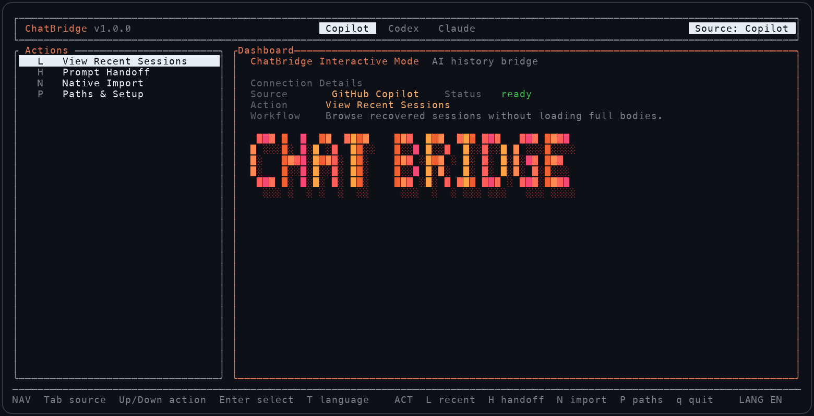

<div align="center">

# ChatBridge

**Local AI chat history bridge for GitHub Copilot, Codex CLI, and Claude Code.**

[](https://github.com/ylexLiao/chatbridge/actions)
[](https://github.com/ylexLiao/chatbridge/releases)
[](LICENSE)
[](#installation)
[](rust/chatbridge-tui)

[English](README.md) | [中文](README.zh-CN.md)

</div>

ChatBridge is a local TUI/CLI for browsing, handing off, repairing, and native-importing chat histories across Copilot Chat, Codex CLI, and Claude Code.

It does not call a cloud service by default. It reads and writes local history files, creates backups before writes, and keeps imported chats visible in each target tool's own history or resume UI.

## Screenshot



## Highlights

- Browse recovered Copilot, Codex, and Claude Code sessions without loading every full transcript.
- Generate handoff prompts when you want another agent to continue.
- Native-import sessions into the target tool's local history format.
- Export a session as a portable JSON bundle and import it on another machine (for example over SSH).
- Repair old imports that are missing index, cache, or JSONL files.
- Diagnose local history paths for VS Code, Insiders, VSCodium, Cursor, Codex, and Claude Code.
- Replace embedded image base64 with readable attachment placeholders instead of dumping huge text into chats.

## Installation

Requirements: Python 3.10 or newer. The recommended release installer bundles the Rust TUI, so Rust/Cargo is not needed unless you build from source.

### Recommended: prebuilt release

macOS / Linux:

```bash
curl --http1.1 -fsSL https://github.com/ylexLiao/chatbridge/releases/latest/download/install.sh | bash
chatbridge
```

Windows PowerShell:

```powershell
irm https://github.com/ylexLiao/chatbridge/releases/latest/download/install.ps1 | iex
chatbridge
```

Release installers download a prebuilt Rust TUI for your platform. Users do not need Rust or Cargo for this path.
On macOS and Linux, the installer places the `chatbridge` launcher in a writable bin directory already on your `PATH` when possible; otherwise it falls back to `~/.local/bin` and prints the `PATH` line to add. On Windows, the installer updates the current PowerShell session's `PATH` when needed so the next `chatbridge` command can run immediately.

Update an existing release-installer install:

```bash
chatbridge update
chatbridge --version
```

`chatbridge update` re-downloads the release installer for your platform and reinstalls ChatBridge in place.

Prebuilt release assets currently target macOS arm64/x64, Linux arm64/x64, and Windows x64. Linux release binaries are built with musl to avoid requiring a newer system glibc. Other platforms can use the source build path.

| Platform | Prebuilt asset | Requirement |
| --- | --- | --- |
| macOS Apple Silicon | `chatbridge-macos-arm64.tar.gz` | Python 3.10+ |
| macOS Intel | `chatbridge-macos-x64.tar.gz` | Python 3.10+ |
| Linux arm64 | `chatbridge-linux-arm64.tar.gz` | Python 3.10+ |
| Linux x64 | `chatbridge-linux-x64.tar.gz` | Python 3.10+ |
| Windows x64 | `chatbridge-windows-x64.zip` | Python 3.10+ |

If `releases/latest/download/install.sh` returns `404`, the GitHub Release assets have not been published yet. Use the source installer until the release workflow has produced the assets:

```bash
curl --http1.1 -fsSL https://raw.githubusercontent.com/ylexLiao/chatbridge/main/install.sh | bash -s -- --from-source --bootstrap-rust
chatbridge
```

### npm from GitHub

```bash
npm install -g github:ylexLiao/chatbridge
chatbridge
```

This source install builds the Rust TUI during `postinstall`, so it requires Cargo. It is useful before a published npm package exists.

### From source

```bash
git clone https://github.com/ylexLiao/chatbridge.git
cd chatbridge
npm test
npm run build:tui
./bin/chatbridge
```

Source builds require Rust/Cargo.

### Homebrew

Homebrew tap publishing is planned. The repository currently includes a formula template in [packaging/homebrew/chatbridge.rb](packaging/homebrew/chatbridge.rb), but `brew install chatbridge` / `brew upgrade chatbridge` are not published commands yet.

## Uninstall

macOS / Linux:

```bash
rm -f ~/.local/bin/chatbridge ~/.local/bin/chatbridge-tui
rm -rf ~/.local/share/chatbridge
hash -r 2>/dev/null || true
```

Windows PowerShell:

```powershell
Remove-Item -Force "$HOME\.local\bin\chatbridge.cmd","$HOME\.local\bin\chatbridge.ps1" -ErrorAction SilentlyContinue
Remove-Item -Recurse -Force "$HOME\.local\share\chatbridge" -ErrorAction SilentlyContinue
```

These commands remove the `chatbridge` launcher and the installed ChatBridge package. They keep `~/.chatbridge/config.json` and do not delete Copilot, Codex, Claude Code, or VS Code history files.
If you installed with custom `--prefix` or `--dir` values, remove the matching `bin/chatbridge` launcher and install directory instead.

You can also let the installer remove the default install:

```bash
curl --http1.1 -fsSL https://github.com/ylexLiao/chatbridge/releases/latest/download/install.sh | bash -s -- --uninstall
```

To reinstall and smoke-test:

```bash
curl --http1.1 -fsSL https://github.com/ylexLiao/chatbridge/releases/latest/download/install.sh | bash
chatbridge paths doctor
```

## Quick Start

```bash
chatbridge paths doctor
chatbridge list --source copilot --limit 5
chatbridge list --source codex --limit 5
chatbridge list --source claude --limit 5
```

Generate a handoff prompt:

```bash
chatbridge handoff --from copilot --to codex --last
```

Native import into another tool:

```bash
chatbridge native-import --from codex --to claude --session <session-id> --apply
chatbridge native-import --from claude --to copilot --session <session-id> --project /path/to/repo --apply
```

`native-import` is a dry run unless `--apply` is provided. By default the import lands in the session's own project path (the project recorded in the source history), regardless of your current directory; pass `--project` to choose a different destination project. Dry runs print a `Target project:` line so you can check the destination first.

Export a session as a portable bundle and import it elsewhere:

```bash
chatbridge export --from copilot --session <session-id>
chatbridge native-import --bundle chatbridge-export-copilot-<session-id>.json --to claude --apply
```

## Supported Sources And Targets

| Tool | Read | Native import target | Local state |
| --- | --- | --- | --- |
| GitHub Copilot Chat | Yes | Yes | VS Code `workspaceStorage`, `chatSessions`, chat index, Agent Sessions cache |
| Codex CLI | Yes | Yes | `~/.codex/state_5.sqlite`, rollout JSONL, session/history indexes |
| Claude Code | Yes | Yes | `~/.claude/history.jsonl`, project transcript JSONL |

## Path Setup

Inside the TUI, press `P` to open the path setup form. Choose the target path, type the directory, and press `Enter` to save it. Press `Ctrl+D` inside the form to run the same diagnostics as `chatbridge paths doctor` (the old `?` shortcut now types a literal `?` into the path input).

```bash
chatbridge paths doctor
chatbridge paths set --copilot-workspace-storage /path/to/workspaceStorage
chatbridge paths set --codex-home /path/to/.codex
chatbridge paths set --claude-home /path/to/.claude
chatbridge paths edit
```

Overrides are stored in `~/.chatbridge/config.json`.

Environment variables are also supported:

```bash
CHATBRIDGE_COPILOT_WORKSPACE_STORAGE=/path/to/workspaceStorage
CHATBRIDGE_CODEX_HOME=/path/to/.codex
CHATBRIDGE_CLAUDE_HOME=/path/to/.claude
CHATBRIDGE_API_TIMEOUT=120
```

`CHATBRIDGE_API_TIMEOUT` sets the timeout in seconds for the backend commands the TUI runs (default 120). You can also press `Esc` to cancel a long-running load early.

## Native Import Safety

ChatBridge writes target-native files instead of only dropping a summary into plain text.

- Codex imports write rollout JSONL plus visible `state_5.sqlite`, `session_index.jsonl`, and `history.jsonl` rows.
- Claude Code imports write chained project transcript rows plus `history.jsonl`.
- Copilot imports write VS Code `chatSessions/*.jsonl` and `.json`, `chat.ChatSessionStore.index`, and Agent Sessions cache entries.

For Copilot imports, fully quit all VS Code windows before using `--apply`. VS Code keeps chat indexes in memory and may overwrite offline writes when it exits.

Repair older imports:

```bash
chatbridge repair-codex-imports --apply
chatbridge repair-claude-imports --apply
chatbridge repair-copilot-imports --apply
```

## Export Bundles And Remote Machines

`chatbridge export` writes one session to a portable JSON bundle (`"format": "chatbridge-bundle"`, `"version": 1`):

```bash
chatbridge export --from copilot --session <session-id>
# -> ./chatbridge-export-copilot-<session-id>.json  (use --out PATH to change it)
```

The bundle stores the session metadata (source, title, project path, timestamps) plus its messages and artifacts. Text is redacted and embedded base64 images are replaced with placeholders before the file is written, so the bundle is safe to move between machines. In the TUI, every source offers an `Export bundle (.json)` option in the target picker.

To continue a local session on a remote machine (Remote SSH and similar):

```bash
# 1. Local machine: export the session
chatbridge export --from copilot --session <session-id>

# 2. Copy the bundle to the remote machine
scp chatbridge-export-copilot-<session-id>.json remote:

# 3. Remote machine: import the bundle natively (no source history needed there)
chatbridge native-import --bundle chatbridge-export-copilot-<session-id>.json --to codex --apply
chatbridge native-import --bundle chatbridge-export-copilot-<session-id>.json --to claude --apply
```

When the bundled session's project is a `vscode-remote://` URI, importing to Codex or Claude Code automatically translates it to the remote filesystem path (for example `vscode-remote://ssh-remote%2Bbox/home/ubuntu/app` becomes `/home/ubuntu/app`). Pass `--project` to override the destination project.

## Copilot Local And Remote Workspaces

Copilot Chat history is stored in the local VS Code user-data directory, even when the project is opened through Remote SSH, Dev Containers, WSL, or another `vscode-remote://` URI.

For a remote project, ChatBridge still writes to the local machine's VS Code `workspaceStorage`. The workspace id is the MD5 hash of the remote URI, and `workspace.json` keeps the remote folder URI:

```text
workspaceStorage/md5("vscode-remote://...")/workspace.json
workspaceStorage/md5("vscode-remote://...")/chatSessions/<session-id>.jsonl
workspaceStorage/md5("vscode-remote://...")/chatSessions/<session-id>.json
```

So a Copilot remote import writes into the local VS Code profile that owns the remote workspace history, not into the remote server filesystem.

## Embedded Images

Some source transcripts store images as huge `data:image/...;base64,...` strings. ChatBridge does not import those as native attachments because the original attachment file/reference is usually unavailable. It replaces the base64 body with a short note:

```text
[Image attachment not imported: embedded PNG data URL, approx 820.0 KB]
```

## Development

```bash
npm test
npm run test:rust
npm run build:tui
npm pack --dry-run
```

## Acknowledgments

Thanks for the help from LINUXDO: https://linux.do

## License

MIT
